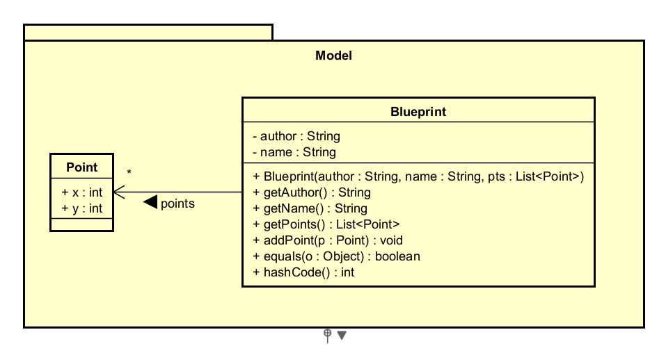

## Laboratorio #4 – REST API Blueprints (Java 21 / Spring Boot 3.3.x)
# Escuela Colombiana de Ingeniería – Arquitecturas de Software  

---

## 📋 Requisitos
- Java 21
- Maven 3.9+

## ▶️ Ejecución del proyecto
```bash
mvn clean install
mvn spring-boot:run
```
Probar con `curl`:
```bash
curl -s http://localhost:8080/blueprints | jq
curl -s http://localhost:8080/blueprints/john | jq
curl -s http://localhost:8080/blueprints/john/house | jq
curl -i -X POST http://localhost:8080/blueprints -H 'Content-Type: application/json' -d '{ "author":"john","name":"kitchen","points":[{"x":1,"y":1},{"x":2,"y":2}] }'
curl -i -X PUT  http://localhost:8080/blueprints/john/kitchen/points -H 'Content-Type: application/json' -d '{ "x":3,"y":3 }'
```

> Si deseas activar filtros de puntos (reducción de redundancia, *undersampling*, etc.), implementa nuevas clases que implementen `BlueprintsFilter` y cámbialas por `IdentityFilter` con `@Primary` o usando configuración de Spring.
---

Abrir en navegador:  
- Swagger UI: [http://localhost:8080/swagger-ui.html](http://localhost:8080/swagger-ui.html)  
- OpenAPI JSON: [http://localhost:8080/v3/api-docs](http://localhost:8080/v3/api-docs)  

---

## 🗂️ Estructura de carpetas (arquitectura)

```
src/main/java/edu/eci/arsw/blueprints
  ├── model/         # Entidades de dominio: Blueprint, Point
  ├── persistence/   # Interfaz + repositorios (InMemory, Postgres)
  │    └── impl/     # Implementaciones concretas
  ├── services/      # Lógica de negocio y orquestación
  ├── filters/       # Filtros de procesamiento (Identity, Redundancy, Undersampling)
  ├── controllers/   # REST Controllers (BlueprintsAPIController)
  └── config/        # Configuración (Swagger/OpenAPI, etc.)
```

> Esta separación sigue el patrón **capas lógicas** (modelo, persistencia, servicios, controladores), facilitando la extensión hacia nuevas tecnologías o fuentes de datos.

---

## 📖 Actividades del laboratorio

### 1. Familiarización con el código base

### 1.1 Revisa el paquete `model` con las clases `Blueprint` y `Point`. 

**Diagrama de clases model UML**



Estas son las entidades principales que representan los planos y sus puntos. Observa cómo se estructuran y qué atributos tienen.

**Clase `Point.java`:** 

Esta clase usa un Java Record que es una forma concisa de crear clases de datos inmutables. 

Automáticamente genera:

- Constructor: Point(int x, int y)
- Getters: x() y y() 
- equals(): Compara puntos por sus coordenadas
- hashCode(): Para usar en colecciones
- toString(): Representación textual "Point[x=1, y=2]"

Características:

- Inmutable: No se pueden cambiar las coordenadas después de crear el punto
- Validación: Las coordenadas son enteros (int)
- Uso: Representa una coordenada cartesiana en un plano 2D

**Clase `Blueprint.java`:**

Esta clase representa un plano que tiene un autor, un nombre y una lista de puntos.

Atributos:

```java
private String author;        // Autor del plano
private String name;          // Nombre del plano
private final List<Point> points = new ArrayList<>();  // Lista de puntos
```
- La lista points es final 
- Se inicializa vacía y se llena en el constructor

Contructor:

```java
public Blueprint(String author, String name, List<Point> pts) {
    this.author = author;
    this.name = name;
    if (pts != null) points.addAll(pts);
} 
```
- Recibe el autor, nombre y una lista de puntos
- Copia los pintos a su propia lista para mantener la inmutabilidad de la referencia

Getters:
```java
public String getAuthor() { return author; }
public String getName() { return name; }
public List<Point> getPoints() { 
    return Collections.unmodifiableList(points); 
}
```
- Devuelve el autor, nombre y una lista inmodificable de puntos

Metodo para agregar puntos:
```java
public void addPoint(Point p) {
    points.add(p);
}
```
- Permite agregar un punto al plano

Metodos de identidad e igualdad:
```java
@Override
public boolean equals(Object o) {
    if (this == o) return true;
    if (!(o instanceof Blueprint bp)) return false;
    return Objects.equals(author, bp.author) && 
           Objects.equals(name, bp.name);
}

@Override
public int hashCode() {
    return Objects.hash(author, name);
}
```
- Dos planos son iguales si tienen el mismo autor y nombre, sin importar los puntos
- hashCode se basa en autor y nombre para uso en colecciones

### 1.2 Entiende la capa `persistence` con `InMemoryBlueprintPersistence`.

**Intefaz 'BlueprintPersistence'**

Define el contrato para la persistencia de planos.

```java
public interface BlueprintPersistence {
    void saveBlueprint(Blueprint bp) throws BlueprintPersistenceException;
    Blueprint getBlueprint(String author, String name) throws BlueprintNotFoundException;
    Set<Blueprint> getBlueprintsByAuthor(String author) throws BlueprintNotFoundException;
    Set<Blueprint> getAllBlueprints();
    void addPoint(String author, String name, int x, int y) throws BlueprintNotFoundException;
}
```
Operaciones CRUD:

- Create: saveBlueprint() - Guarda un nuevo blueprint
- Read: getBlueprint(), getBlueprintsByAuthor(), getAllBlueprints()
- Update: addPoint() - Actualiza agregando un punto

**Implementacion `InMemoryBlueprintPersistence`**

Estrcuctura de datos:
```java
private final Map<String, Blueprint> blueprints = new ConcurrentHashMap<>();
```
- ConcurrentHashMap: Thread-safe para acceso concurrente 
- Clave: String compuesta "author:name" (ej: "john:house")
- Valor: El objeto Blueprint completo

Sistema de claves:
```java
private String keyOf(Blueprint bp) { 
    return bp.getAuthor() + ":" + bp.getName(); 
}

private String keyOf(String author, String name) { 
    return author + ":" + name; 
}
```
- Genera claves compuestas como string para cada plano basado en autor y nombre 

Contructor:
```java
public InMemoryBlueprintPersistence() {
    Blueprint bp1 = new Blueprint("john", "house",
            List.of(new Point(0,0), new Point(10,0), new Point(10,10), new Point(0,10)));
    Blueprint bp2 = new Blueprint("john", "garage",
            List.of(new Point(5,5), new Point(15,5), new Point(15,15)));
    Blueprint bp3 = new Blueprint("jane", "garden",
            List.of(new Point(2,2), new Point(3,4), new Point(6,7)));
    
    blueprints.put(keyOf(bp1), bp1);
    blueprints.put(keyOf(bp2), bp2);
    blueprints.put(keyOf(bp3), bp3);
}
```
- Inicializa con algunos planos de ejemplo

Metodo saveBlueprint():
```java
@Override
public void saveBlueprint(Blueprint bp) throws BlueprintPersistenceException {
    String k = keyOf(bp);
    if (blueprints.containsKey(k)) 
        throw new BlueprintPersistenceException("Blueprint already exists: " + k);
    blueprints.put(k, bp);
}
```
- Genera la clave del blueprint
- Validación: Si ya existe, lanza excepción 
- Si no existe, lo guarda en el mapa
- No se permite duplicados 

Metodo getBlueprint():
```java
@Override
public Blueprint getBlueprint(String author, String name) throws BlueprintNotFoundException {
    Blueprint bp = blueprints.get(keyOf(author, name));
    if (bp == null) 
        throw new BlueprintNotFoundException("Blueprint not found: %s/%s".formatted(author, name));
    return bp;
}
```
- Busca en el mapa usando la clave compuesta
- Si no existe (null), lanza excepción
- Si existe, retorna el blueprint

Metodo getBlueprintsByAuthor():
```java
@Override
public Set<Blueprint> getBlueprintsByAuthor(String author) throws BlueprintNotFoundException {
    Set<Blueprint> set = blueprints.values().stream()
            .filter(bp -> bp.getAuthor().equals(author))
            .collect(Collectors.toSet());
    if (set.isEmpty()) 
        throw new BlueprintNotFoundException("No blueprints for author: " + author);
    return set;
}
```
- Leer por autor 
- Stream: Itera sobre todos los blueprints del mapa
- Filter: Filtra por autor usando equals()
- Collect: Recopila en un Set
- Si encuentra al menos uno, retorna el Set
- Si no encuentra ninguno, lanza excepción

Metodo getAllBlueprints():
```java
@Override
public Set<Blueprint> getAllBlueprints() {
    return new HashSet<>(blueprints.values());
}
```
- Retorna un nuevo HashSet con todos los blueprints del mapa

Metodo addPoint():
```java
@Override
public void addPoint(String author, String name, int x, int y) throws BlueprintNotFoundException {
    Blueprint bp = getBlueprint(author, name);
    bp.addPoint(new Point(x, y));
}
```
- Busca el blueprint por autor y nombre
- Si no existe, getBlueprint() lanzará excepción
- Si existe, agrega un nuevo punto al blueprint usando su método addPoint()

### 1.3 Analiza la capa services `(BlueprintsServices)` y el controlador `BlueprintsAPIController`.

**Clase `BlueprintsServices.java`:**

Esta clase es la capa de servicios que actúa como intermediaria entre el controlador y la persistencia. Encapsula la lógica de negocio y coordina las operaciones con filtros.

Dependencias:
```java
private final BlueprintPersistence persistence;
private final BlueprintsFilter filter;

public BlueprintsServices(BlueprintPersistence persistence, BlueprintsFilter filter) {
    this.persistence = persistence;
    this.filter = filter;
}
```
- `BlueprintPersistence`: Interfaz para acceso a datos
- `BlueprintsFilter`: Filtro para procesar blueprints al consultarlos
- Constructor: Inyección por constructor

Métodos de negocio:

**addNewBlueprint(Blueprint bp):**
```java
public void addNewBlueprint(Blueprint bp) throws BlueprintPersistenceException {
    persistence.saveBlueprint(bp);
}
```
- Delega a la capa de datos
- Propaga la excepción si el blueprint ya existe

**getAllBlueprints():**
```java
public Set<Blueprint> getAllBlueprints() {
    return persistence.getAllBlueprints();
}
```
- Obtiene todos los blueprints sin aplicar filtros
- Retorna un Set de todos los planos disponibles

**getBlueprintsByAuthor(String author):**
```java
public Set<Blueprint> getBlueprintsByAuthor(String author) throws BlueprintNotFoundException {
    return persistence.getBlueprintsByAuthor(author);
}
```
- Obtiene todos los blueprints de un autor específico
- No aplica filtros a la colección completa
- Lanza excepción si el autor no tiene blueprints

**getBlueprint(String author, String name):**
```java
public Blueprint getBlueprint(String author, String name) throws BlueprintNotFoundException {
    return filter.apply(persistence.getBlueprint(author, name));
}
```
- Obtiene un blueprint individual por autor y nombre
- Aplica el filtro configurado antes de retornarlo
- El filtro puede modificar los puntos
- Es el único método que aplica filtros

**addPoint(String author, String name, int x, int y):**
```java
public void addPoint(String author, String name, int x, int y) throws BlueprintNotFoundException {
    persistence.addPoint(author, name, x, y);
}
```
- Agrega un punto a un blueprint existente
- Delega la operación a la capa de persistencia

---

**Clase `BlueprintsAPIController.java`:**

Esta clase es el controlador REST que expone los endpoints HTTP.

Anotaciones de clase:
```java
@RestController
@RequestMapping("/blueprints")
```
- `@RequestMapping("/blueprints")`: Todas las rutas inician con /blueprints

Dependencia:
```java
private final BlueprintsServices services;

public BlueprintsAPIController(BlueprintsServices services) { 
    this.services = services; 
}
```
- Inyecta BlueprintsServices por constructor
- Delega toda la lógica al servicio

Endpoints REST:

**1. GET /blueprints**
```java
@GetMapping
public ResponseEntity<Set<Blueprint>> getAll() {
    return ResponseEntity.ok(services.getAllBlueprints());
}
```
- Retorna todos los blueprints del sistema
- Código HTTP: 200 OK

**2. GET /blueprints/{author}**
```java
@GetMapping("/{author}")
public ResponseEntity<?> byAuthor(@PathVariable String author) {
    try {
        return ResponseEntity.ok(services.getBlueprintsByAuthor(author));
    } catch (BlueprintNotFoundException e) {
        return ResponseEntity.status(HttpStatus.NOT_FOUND)
                             .body(Map.of("error", e.getMessage()));
    }
}
```
- `@PathVariable`: Extrae el autor de la URL
- Si existe: Retorna Set de blueprints con 200 OK
- Si no existe: Retorna 404 NOT_FOUND
- Formato de error: `{"error": "mensaje"}`

**3. GET /blueprints/{author}/{bpname}**
```java
@GetMapping("/{author}/{bpname}")
public ResponseEntity<?> byAuthorAndName(@PathVariable String author, @PathVariable String bpname) {
    try {
        return ResponseEntity.ok(services.getBlueprint(author, bpname));
    } catch (BlueprintNotFoundException e) {
        return ResponseEntity.status(HttpStatus.NOT_FOUND)
                             .body(Map.of("error", e.getMessage()));
    }
}
```
- Obtiene un blueprint específico
- Dos parámetros de ruta: author y bpname
- Si existe: 200 OK con el blueprint
- Si no existe: 404 NOT_FOUND con mensaje de error

**4. POST /blueprints**
```java
@PostMapping
public ResponseEntity<?> add(@Valid @RequestBody NewBlueprintRequest req) {
    try {
        Blueprint bp = new Blueprint(req.author(), req.name(), req.points());
        services.addNewBlueprint(bp);
        return ResponseEntity.status(HttpStatus.CREATED).build();
    } catch (BlueprintPersistenceException e) {
        return ResponseEntity.status(HttpStatus.FORBIDDEN)
                             .body(Map.of("error", e.getMessage()));
    }
}
```
- Crea un nuevo blueprint desde el request
- Si es exitoso: 201 CREATED
- Si ya existe: 403 FORBIDDEN con mensaje de error

**5. PUT /blueprints/{author}/{bpname}/points**
```java
@PutMapping("/{author}/{bpname}/points")
public ResponseEntity<?> addPoint(@PathVariable String author, @PathVariable String bpname,
                                  @RequestBody Point p) {
    try {
        services.addPoint(author, bpname, p.x(), p.y());
        return ResponseEntity.status(HttpStatus.ACCEPTED).build();
    } catch (BlueprintNotFoundException e) {
        return ResponseEntity.status(HttpStatus.NOT_FOUND)
                             .body(Map.of("error", e.getMessage()));
    }
}
```
- Agrega un punto a un blueprint existente
- Recibe Point en el body JSON: `{"x":3, "y":3}`
- Si existe: 202 ACCEPTED
- Si no existe: 404 NOT_FOUND

**DTO - NewBlueprintRequest:**
```java
public record NewBlueprintRequest(
        @NotBlank String author,
        @NotBlank String name,
        @Valid java.util.List<Point> points
) { }
```
- Record de Java para request de creación
- `@NotBlank`: Valida que author y name no estén vacíos
- `@Valid`: Valida cada Point de la lista
- Se usa solo en el POST

Códigos HTTP utilizados:
- **200 OK**: Consultas exitosas (GET)
- **201 CREATED**: Recurso creado exitosamente (POST)
- **202 ACCEPTED**: Actualización aceptada (PUT)
- **403 FORBIDDEN**: Blueprint ya existe (POST con duplicado)
- **404 NOT_FOUND**: Recurso no encontrado (GET/PUT fallidos)

## 2. Migración a persistencia en PostgreSQL

### 1.2 Configura una base de datos PostgreSQL usando Docker.

- `docker-compose.yml` en la raiz del proyecto

```yml
version: '3.8'
services:
  postgres:
    image: postgres:16
    container_name: blueprints-postgres
    environment:
      POSTGRES_DB: blueprintsdb
      POSTGRES_USER: postgres
      POSTGRES_PASSWORD: postgres
    ports:
      - "5432:5432"
    volumes:
      - postgres-data:/var/lib/postgresql/data

volumes:
  postgres-data:
```
- Ejecucion(tener Docker desktop instalado y abierto previamiente):

```bash
docker-compose up -d
```

- Dependencias necesarias en `pom.xml`

```xml
<dependency>
    <groupId>org.springframework.boot</groupId>
    <artifactId>spring-boot-starter-data-jpa</artifactId>
</dependency>
<dependency>
    <groupId>org.postgresql</groupId>
    <artifactId>postgresql</artifactId>
    <scope>runtime</scope>
</dependency>
```

- Configuracion de `appication.properties`

```properties
spring.datasource.url=jdbc:postgresql://localhost:5432/blueprintsdb
spring.datasource.username=postgres
spring.datasource.password=postgres
spring.datasource.driver-class-name=org.postgresql.Driver

spring.jpa.hibernate.ddl-auto=update
spring.jpa.show-sql=true
spring.jpa.properties.hibernate.dialect=org.hibernate.dialect.PostgreSQLDialect
```


### 1.3 Implementa un nuevo repositorio PostgresBlueprintPersistence que reemplace la versión en memoria.

### 1.4 Mantén el contrato de la interfaz BlueprintPersistence.